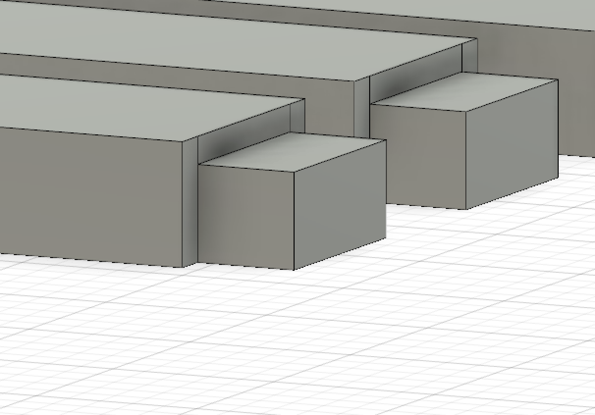

# Chaise moderne CNC

Le modèle a été créé sur base d'une esquisse faite dans Adobe Illustrator avant d'être retravaillée dans Fusion 360 afin de générer un fichier 3D lisible par la CNC.

Pour faire ce modèle, il a fallut intégrer des contraintes au niveau du fonctionnement de la machine, de la résistance des matériaux ainsi que de la dimension standard des panneaux vendus dans le commerce.

1. CONTRAINTES DE LA MACHINE: la CNC n'usine que du haut vers le bas \(axe Z\). Il faut donc adapter le dessin des tenons classiques en tenons batards. Au contraire des plus courants, ces tenons disposent d'une surface plane et d'une seule surface travaillée.

La seconde contrainte de la machine, est que la plupart des angles sont arrondis à cause du principe même de la fraise \(étant circulaire, elle ne peut créer des angles droit\). Il faudra donc équarrir les angles à la main, une fois les pièces sorties de la machine.

Il est cependant possible d'éviter de retravailler les pièces en utilisant des "_dogbones_" dans les angles des mortaises. Mais en tenant compte du design donnant des allures de légèreté à la chaise, l'utilisation de ces dogbones ne serait pas indiquée dans ce cas précis. 

Les dernières contraintes de la machine sont liées à ses caractéristiques techniques, telles que la vitesse de la broche \(nombre de rotations de la fraise par minute\) - prédéterminée sur le moteur de la machine - , sa surface usinable \(ici de 138 sur 78 cm\), et les caractéristiques de la fraise utilisée.

2. CONTRAINTES DU MATERIAU: le multiplex est composé de plusieurs couches de bois \(appelées "plis"\) dont le sens du fil est inversé à chaque superposition. La solidité d'un panneau tient donc dans la multiplication de ces plis. C'est pourquoi, un panneau de mutliplex 11 plis est préférable à un 7 plis, par exemple. Le choix du bois en lui-même importe aussi: un panneau multiplex 11 plis de bouleau sera encore plus solide que son homologue en pin, et moins sujet aux éclats.

Ensuite, les panneaux disponibles dans le commerce ont une dimension de 244 sur 122 cm. Il faut donc en tenir compte lors du dessin afin d'optimiser l'espace disponible sur le panneau. 

