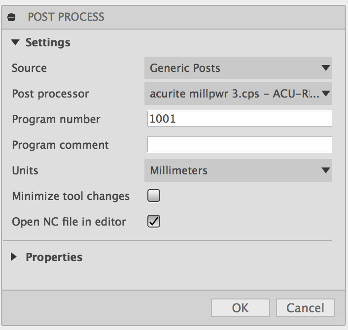

# Fusion 360 et l'usinage CNC

Ce tutorial couvre la partie CAM de Fusion, afin de l’utiliser avec la CNC du trakk via Kai. Il suppose que le design que vous voulez découper est déjà prêt. 

Pour plus d’info sur la CNC [c’est ici](../../tools/cnc.md)

##  Fusion 360

Fusion est un logiciel de CAD \(Dessin assisté par ordinateur\) et CAM \( Manufacture assisté par ordinateur\) Il permet d’avoir un cycle de travail entier dans le même logiciel, de la création du design à la création du code permettant de contrôler la fraiseuse automatique, l’imprimante 3D etc… 

**Astuce**: pour comprendre une des options proposée par fusion, laissez votre pointer de souris au dessus de cette option, Fusion ouvrira automatiquement une fenêtre expliquant les effets que celle-ci aura.  
Une fois votre design prêt, rendez vous dans la partie CAM de Fusion360.

U ne fois votre design prêt, rendez vous dans la partie CAM de Fusion360.

 Le logiciel fusion360 présente un déroulement de travail de gauche à droite dans chacune de ses parties \(Model, Cam, Render, Animation…\). Pour créer le fichier permettant à la CNC de découper notre pièce nous commencerons donc par créer un nouveau set-up, puis utiliser une découpe 3D pour finir par 2 actions: la simulation et la génération du gcode via post-processing.

## Setup de la pièce

 Le set-up \(préparation\) de la pièce se fait en trois partie: d’abord faire coïncider l’espace 3D de votre pièce avec celui de la CNC. On va donc définir les axes Z \(l’axe correspondant au foret de la CNC\) et X \(l’axe correspondant à la longueur de la CNC\), ainsi que le stock point, qui est le point d’origine de votre pièce que vous aller définir avec [KAY ](../galaad.md)en bougeant la tête de la CNC.  

Une fois le point d’origine et le système de coordonnées établi, il faut s’assurer que le stock de votre pièce ne présente pas de décalage pour la découpe \(offset\). En supprimant tous les offsets, on s’assure que la découpe sera fidèle au dimensions initiales de votre modèle.

 Une fois que l’on s’est assuré que ces décalages étaient égal à 0. On peut valider le set-up

## **II Définition de l'usinage 3D.**

  
En premier lieu, dans le premier onglet, nous allons définir l’outil \(tool\) que nous voulons utiliser. Vous pouvez aussi créer un outil avec les dimensions de votre foret.  

La vitesse de rotation et d’avance seront défini en fonction de la matière usinée \( Voir[ ici ](../../tools/cnc.md#vitesse-davance-et-vitesse-de-coupe) \)    
Dans l’onglet géométrie, nous devons définir les contours à l’intérieur desquelles la coupe aura lieu \(stock contours\)

Dans l’onglet Passes, il s’agit de définir la profondeur de chaque passe \(change en fonction de l’outil et du matériau : voir [vitesses](../../tools/cnc.md#vitesse-davance-et-vitesse-de-coupe)\) et s’assurer que la case stock to leave est décochée.

 On peut alors valider et voir apparaitre le tracé de votre découpe.

## **III Simulation et post-processing**

  
Afin de finaliser le fichier et l’exporter dans un format lisible par le logiciel de la CNC. Tout d’abord on peut simuler la découpe de l’objet afin de vérifier que les tracés de l’outil sont conformes à ce qui est attendu.  
On va donc cliquer sur Simulate dans l’onglet action.

 La simulation apparait et on peut changer quelques options comme la vitesse de défilement. Mais l’option qui nous intéresse le plus est celle qui permet de faire apparaitre le bloc et de le voir usiné comme la CNC va le faire. Afin de faire apparaitre le bloc, il faut cliquer sur la case stock

 Une fois que l’on s’est assuré que le tracé est valide, on peut exporter le fichier grâce à un post-processing. Il faut cliquer sur la plage post-process dans l’onglet action puis sélectionner acurite milpwr3 comme format d’export.

On peut alors enregistrer le fichier sur une clef pour l’utiliser avec la CNC via Kai.  

## **Ouverture avec KAI**

  
Utiliser Fichier&gt;import et selectionner gcode iso comme format.  
**Refuser** les deux pop-up qui propose de basculer le modèle en valeur absolue. 

